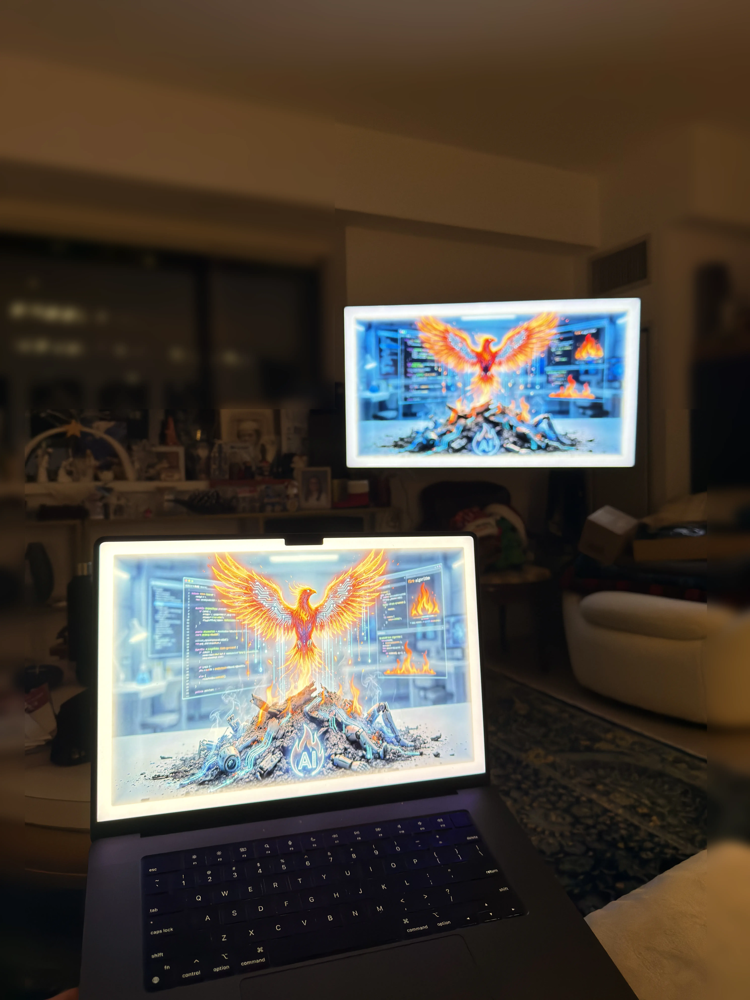

# MacEdgeLight

<table><tr>
<td valign="top"><b>Make your Mac glow.</b> A stunning ambient edge light that wraps your entire screen in a smooth, customizable glow — perfect for streaming, presentations, focus sessions, or just making your desktop look incredible.<br><br>Inspired by <a href="https://github.com/shanselman/EdgeLight">Windows Edge Light</a> by Scott Hanselman. Built natively for macOS.</td>
<td></td>
</tr></table>

## Why MacEdgeLight?

| Use Case | How It Helps |
|---|---|
| **Streaming & Content Creation** | Add a professional ambient glow to your setup. Toggle capture visibility so viewers see the effect — or keep it private. |
| **Presentations & Demos** | Frame your screen with light to draw audience attention. Hide desktop icons for a clean look. Cursor reveal spotlights where you're pointing. |
| **Late Night Coding** | Warm amber glow reduces eye strain. Adjustable brightness from whisper-quiet to blazing bloom. |
| **Focus & Productivity** | The glow creates a visual boundary that keeps your eyes on screen. Auto-hiding controls stay out of your way. |
| **Multi-Monitor Setups** | Light up one monitor or all of them. Cycle between displays instantly. |
| **Replace Your Ring Light** | A software ring light that lives on your screen — no desk clutter, no power cables, no USB hubs. Travels with your laptop. |

### MacEdgeLight vs. Physical Ring Lights

| | MacEdgeLight | Physical Ring Light |
|---|---|---|
| **Cost** | Free | $30–$100+ |
| **Setup** | Download and run | Mount, cable, power supply |
| **Portability** | Built into your Mac — goes everywhere | Extra gear to pack and carry |
| **Adjustability** | Brightness, color temp, border width, bloom — all instant | Limited dials, fixed position |
| **Desk Space** | Zero | Needs a stand or clip |
| **Multi-Monitor** | One click to light all screens | Buy one per monitor |
| **Screen Capture** | Toggle on/off per recording | Always physically visible |
| **Eye Strain** | Glow wraps the screen edge — light comes from where you're looking | Light source pointed at your face |

## Features

### Edge Light Overlay
- Smooth glowing border around your entire screen with rounded corners
- Adjustable brightness from subtle (20%) to blazing bloom (200%)
- Color temperature control from cool blue-white to warm amber
- Adjustable border width (10px–150px)
- Click-through — never interferes with your work
- Hold any adjustment button for continuous fine-grained control

### Bloom Mode
- Push brightness past 100% for an additive white-hot bloom effect
- Glow radius expands and intensifies at higher brightness levels
- Smooth animated transitions between all settings

### Cursor Reveal
- Toggle a feathered circular cutout that follows your cursor
- See through the glow wherever your mouse goes — great for presentations

### Screen Capture Control
- Hidden from screen capture by default (invisible in Zoom, Teams, or recordings)
- Toggle visibility to show the glow in streams and recordings
- Perfect for streamers who want the effect on camera

### Menu Bar Modes
- **Below** — light stays under the menu bar
- **Extend** — light covers the menu bar for a fully immersive look
- **Auto** (default) — light extends over menu bar but smoothly reveals it when your cursor approaches, then extends back when you move away

### Desktop Icons
- Show/hide all desktop icons with one click
- Clean desktop for presentations, screencasts, or focus time

### Multi-Monitor
- Show on a single monitor or all monitors simultaneously
- Cycle between monitors with a button press
- Adapts automatically when monitors are plugged in or removed

### Auto-Hiding Controls
- Floating HUD toolbar with quick access to everything
- Fades away after 3 seconds of inactivity — reappears instantly on hover
- Background dynamically darkens when overlapping the glow

### Reset to Defaults
- Double-click the lightbulb to reset all light settings
- Reset button on the control bar or status bar menu

### Lightweight
- Pure Swift, native AppKit — no Electron, no web views
- Runs as a menu bar utility (no Dock icon)
- Optional launch at login
- Zero dependencies

## Keyboard Shortcuts

| Shortcut | Action |
|---|---|
| `Cmd + Shift + L` | Toggle light on/off |
| `Cmd + Shift + Up` | Increase brightness |
| `Cmd + Shift + Down` | Decrease brightness |

## Control Bar

The floating toolbar provides quick access to all features:

| Icon | Function | Toggle |
|---|---|---|
| Sun (dim) | Decrease brightness (hold to fine-adjust) | |
| Sun (bright) | Increase brightness (hold to fine-adjust) | |
| Flame | Warmer color temperature (hold to fine-adjust) | |
| Snowflake | Cooler color temperature (hold to fine-adjust) | |
| Compress | Thinner border (hold to fine-adjust) | |
| Expand | Thicker border (hold to fine-adjust) | |
| Lightbulb | Toggle light on/off — double-click to reset | Filled when on |
| Monitor | Switch to next monitor | |
| Monitors | All monitors mode | Filled when on |
| Menu bar | Menu bar mode: Below → Extend → Auto | Cycles through 3 states |
| Circle | Cursor reveal mode | Filled when on |
| Video | Show in screen capture | Filled when on |
| Eye | Hide desktop icons | Swaps to eye.slash |
| Reset | Reset all settings to defaults | |
| X | Quit | |

## Get Started

### Requirements

- macOS 13 Ventura or later
- Retina and non-Retina displays supported
- Wide-gamut (P3) color displays supported

### Installation

Download the latest `.dmg` or `.zip` from [Releases](https://github.com/ChiefInnovator/macedgelight/releases).

The app is signed and notarized by Apple — just open the DMG, drag to Applications, and launch. No Gatekeeper warnings.

### Building from Source

Open `MacEdgeLight.xcodeproj` in Xcode and build, or use the Makefile:

```bash
make build       # Debug build
make release     # Build DMG + zip for distribution
make dmg         # DMG only (drag-to-Applications)
make zip         # Zip only
make clean       # Clean build artifacts
```

## How It Works

The edge light is rendered in a fullscreen, click-through overlay window using Core Graphics. Each frame is drawn with multiple layered passes:

### Rendering Pipeline

1. **Outer glow** — Concentric expanding rounded rectangles drawn outward from the frame edge, each with decreasing opacity. Creates the soft light spill effect around the border.

2. **Solid frame** — The main visible border. A frame shape (outer rect minus inner rect) is filled with a diagonal linear gradient (white → tinted → white) using even-odd clipping. Color temperature shifts the tint from cool blue-white to warm amber.

3. **Inner glow** — Soft light bleeding inward from the frame edge, giving the border a volumetric look.

4. **Bloom mode** — When brightness exceeds 100%, the excess is rendered as additive light using `.plusLighter` blend mode. The glow radius expands proportionally — at 200% brightness, the bloom radius doubles.

5. **Cursor cutout** — A radial gradient in `.destinationOut` blend mode punches a feathered circle through the glow at the cursor position.

### Animation System

All visual properties use per-frame lerp interpolation at 60fps, settling in ~0.3 seconds. Timers run in `.common` run loop mode so animations continue during button hold interactions.

### Display Quality

- **Retina/HiDPI** — Core Graphics rendering at full backing scale factor (2x–3x pixel density)
- **Wide-gamut color** — Uses the display's native color space for accurate P3 color reproduction on MacBook Pro, Studio Display, and Pro Display XDR

### Window Architecture

The overlay ignores all mouse events, sits at a custom window level, and is excluded from screen capture by default. One overlay window is created per active monitor. The control panel floats above the overlay to remain accessible at any border thickness.

## License

[PolyForm Strict License 1.0.0](LICENSE) — Free for noncommercial, personal, educational, and nonprofit use. No redistribution or modification permitted.

## Credits

- Original concept: [Scott Hanselman's EdgeLight](https://github.com/shanselman/EdgeLight)
- macOS implementation by [Richard Crane](https://inventingfirewith.ai)

---

**Transform your screen into an ambient light show with MacEdgeLight!**

[Download the latest release](https://github.com/ChiefInnovator/macedgelight/releases) and give your Mac the glow it deserves.

---

Powered by [MILL5](https://www.mill5.com)
Explore [Richard Crane on Microsoft MVP](https://mvp.microsoft.com/en-US/MVP/profile/10ce0bc0-7536-43f6-b28c-e9601a4a0d0d)
Listen to the [Inventing Fire with AI](https://inventingfirewith.ai) podcast for insights on technology and innovation.
For support, contact: [rich@mill5.com](mailto:rich@mill5.com)
