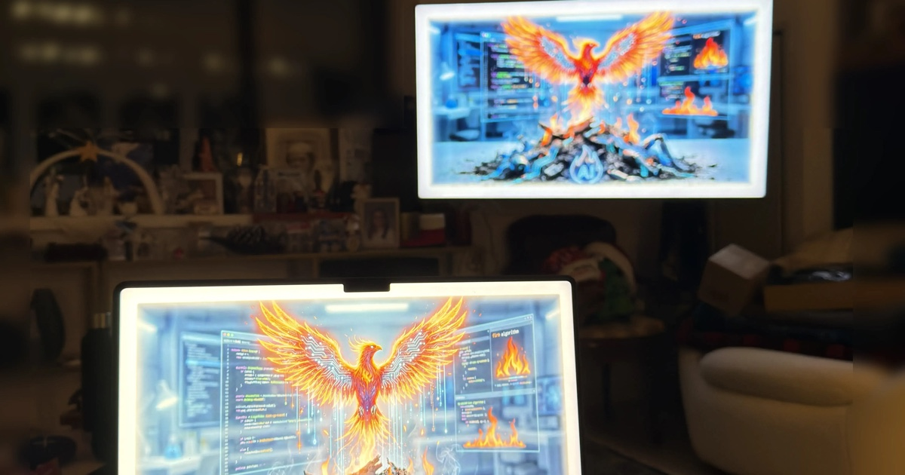

# MacEdgeLight 3.0

**Light for your calls. Brightness for your screen.**

MacEdgeLight is a native macOS menu bar app with two independent tools: an adjustable **screen ring light** for calls, recordings, and presentations, and a **display brightness boost** for compatible EDR displays. Use either one, or both.

[Download version 3.0](https://github.com/ChiefInnovator/macedgelight/releases/tag/v3.0.1) · [Website](https://chiefinnovator.github.io/macedgelight/) · [Release notes](https://github.com/ChiefInnovator/macedgelight/releases/tag/v3.0.1)



## Two Ways to Light Your Mac

| Screen ring light | Display brightness boost |
| --- | --- |
| Adds an adjustable glowing border around the screen. | Uses available extended dynamic range to brighten screen content. |
| Adjust brightness, color temperature, and border width. | Toggle independently of the ring light. |
| Use one display or all connected displays. | Adapts to each compatible display’s own headroom. |
| Choose whether the border appears in screen capture. | Remembers your enabled preference and recovers after interruptions. |
| Toggle with `Command + Shift + L`. | Toggle with `Command + Shift + B`. |

The ring light works without an EDR display. Brightness boost requires a display that macOS reports as EDR-capable; the app marks unsupported displays.

## Why Brightness Matters

> “I am vision impaired and this helps me see my screen.”
>
> — Richard Crane, creator of MacEdgeLight

For people who benefit from additional brightness, seeing text and everyday screen content more clearly can make a practical difference. That personal experience is one reason MacEdgeLight includes brightness boost alongside the ring light.

Extra brightness helps some people with low vision. Results depend on your vision, display, settings, and available headroom. MacEdgeLight also includes a separate magnifier loupe for inspecting details under the cursor.

## What’s New in 3.0

- **Persistent boost preference:** sleep, lock, and user-session changes suspend the renderer without turning off your saved preference.
- **Continuous recovery:** the app keeps checking until your session and display are ready, including when a display reconnects late.
- **Independent display adjustment:** one display’s reduced headroom no longer limits another display’s boost.
- **Gamma repair:** a main-thread timer reapplies a fresh gamma ramp every 0.5 seconds, repairing system resets even when headroom has not changed.
- **Rendering recovery:** the app checks each display for stalled submissions and rebuilds the EDR overlays when needed.
- **Reliable off and quit behavior:** turning boost off cancels recovery; shutdown stops rendering and restores the display’s ColorSync profile.
- **Stronger regression coverage:** tests exercise recovery event ordering, repeated sleep cycles, gamma safety, and the production lifecycle handler. A standalone hardware harness checks gamma readback and supports Thread Sanitizer.

## Features

### Screen Ring Light

- Smooth, rounded, click-through border that leaves your content interactive.
- Adjustable glow brightness, cool-to-warm color temperature, and border width.
- Bloom effect above 100% ring-light brightness. This is an overlay setting, not a claim about physical display luminance.
- Hold adjustment buttons for fine control.
- One-monitor or all-monitor operation, with automatic display-change handling.
- Menu bar modes: **Below**, **Extend**, or **Auto** to reveal the menu bar as the cursor approaches.

### Display Brightness Boost

- Separate menu-bar, toolbar, and keyboard controls.
- Persistent enabled preference and automatic recovery after sleep, unlock, session switching, and reconnection.
- Current-headroom safety clamp for each EDR-capable display.
- Clean ColorSync restoration when disabled.
- Enable **Launch at Login** for restoration after logout or restart.

**What to expect:** macOS determines the brightness headroom available above normal screen white. Brightness settings, display modes, ambient conditions, and thermal limits can change that range. The app cannot guarantee constant physical luminance or override those limits. Boost cannot run while the display is asleep or after logout terminates the app.

**Color response:** while boost is active, the synthetic gamma ramp bypasses Night Shift, True Tone, and hardware calibration. Turning boost off restores the display’s ColorSync profile. Disable boost when you need your normal calibrated color response.

### Magnifier and Presentation Controls

- Floating magnifier loupe follows the cursor.
- Cursor reveal creates a feathered cutout in the glowing border.
- Show or hide desktop icons; icons are restored when the app quits normally.
- Configure whether the ring-light overlay is included in screen capture. Capture behavior can depend on macOS and the recording application.
- Floating, draggable controls with hold-to-repeat adjustments and auto-hide behavior.
- Double-click the lightbulb to reset ring-light settings while preserving boost, magnifier, and desktop-icon state.

## Install

**Requirements:** macOS 13 Ventura or later; Apple silicon or Intel Mac. Ring lighting supports Retina and non-Retina displays. Brightness boost additionally requires EDR support; examples include Liquid Retina XDR MacBook Pro displays and Pro Display XDR.

1. Download the [3.0 DMG](https://github.com/ChiefInnovator/macedgelight/releases/download/v3.0.1/MacEdgeLight.dmg) or [ZIP](https://github.com/ChiefInnovator/macedgelight/releases/download/v3.0.1/MacEdgeLight.zip).
2. Open the DMG and drag **MacEdgeLight** to **Applications**, or extract the ZIP and move the app there.
3. Open MacEdgeLight and use its menu-bar icon or floating controls.
4. Enable **Launch at Login** if you want it to return automatically after signing in.

The release app is signed with Developer ID and notarized by Apple. No account or subscription is required.

## Keyboard Shortcuts

| Shortcut | Action |
| --- | --- |
| `Command + Shift + L` | Toggle the ring light |
| `Command + Shift + Up` | Increase ring-light brightness |
| `Command + Shift + Down` | Decrease ring-light brightness |
| `Command + Shift + B` | Toggle display brightness boost |
| Five rapid, unmodified `Q` taps within two seconds | Quit MacEdgeLight and restore the display profile |

## Frequently Asked Questions

### Can I use brightness boost without the ring light?

Yes. They are independent controls. You can leave the ring light off while using brightness boost, or use the ring light on a display that does not support boost.

### Why is boost enabled but waiting?

The checkmark represents your saved preference. The renderer waits while the display is unavailable, asleep, or in an inactive or locked session. Recovery continues until it is safe to resume. You can turn the preference off while it is waiting.

### Why is the boost sometimes small?

The available EDR headroom changes with the display and macOS conditions. The current implementation caps gamma scaling at 1.45 and 85% of each display’s current headroom, with a neutral floor of 1.0. These are gamma-scale values, not measured brightness increases. See [Apple’s EDR documentation](https://developer.apple.com/documentation/appkit/nsscreen/maximumextendeddynamicrangecolorcomponentvalue).

### Is it free or open source?

The source is available under [PolyForm Strict 1.0.0](LICENSE). It is free for uses permitted by that license; read the full terms for usage, modification, and distribution restrictions. It is not an OSI-approved open-source license.

## Rapid brightness toggles

Version 3.0.1 adds a conservative workaround for displays that fail to regain brightness after a rapid off/on toggle. Turning boost off restores ColorSync immediately. Re-enabling within 30 seconds queues recovery until that off interval ends. The menu shows **Waiting**, and the toolbar shows an hourglass with a countdown tooltip. Turning it off again cancels recovery. This interval is based on observed behavior, not an Apple timing guarantee; it does not promise a fixed physical brightness.

## Build and Test

MacEdgeLight uses Swift and AppKit, with no third-party runtime dependencies. Open `MacEdgeLight.xcodeproj` in Xcode or use:

```bash
make build       # Debug app in build/Debug/MacEdgeLight.app
make test        # Unit tests
make release     # Developer ID signed, notarized DMG and ZIP
make clean       # Remove build artifacts
```

The project uses automatic signing with the MILL5 team (`FS6453639M`) and registered App ID `com.richardcrane.macedgelight`. Hardened Runtime is enabled. Release packaging requires a valid Apple account in **Xcode → Settings → Accounts**, access to MILL5, a Developer ID signing identity, and `create-dmg`.

`make release` uses Xcode’s distribution service for automatic Developer ID signing and notarization, then packages the exported app. It does not use the old `MacEdgeLightNotarize` password profile. If Xcode cannot log in, refresh the account in Xcode Settings before retrying. Apple processing is polled for up to 10 minutes; if it takes longer, rerun `bash scripts/export-notarized.sh build/MacEdgeLight.xcarchive build/export`, then `make package`. For a non-default Xcode installation, prefix commands with `DEVELOPER_DIR=/Applications/Xcode-beta.app/Contents/Developer` (adjust the path to your installation).

For an interactive release, open the project, select **Product → Archive**, then use Organizer’s **Distribute App** flow for **Developer ID / Direct Distribution** and notarization. Export the approved app into `build/export/`, then run `make package`. Packaging verifies the app version, signature, stapled notarization ticket, and Gatekeeper assessment before creating the DMG and ZIP. `make dmg` and `make zip` also require an already notarized export.

For display-pipeline changes, quit MacEdgeLight first, then run:

```bash
bash scripts/test-boost-hardware.sh
bash scripts/test-boost-hardware.sh --thread-sanitizer
```

The harness temporarily enables boost, checks actual gamma readback, forces ColorSync resets, exercises event-tracking mode, and verifies cleanup. It restores ColorSync on completion, a caught failure, or ordinary SIGINT/SIGTERM cancellation. It does not change saved app preferences. Hardware readback is not a physical luminance measurement.

Physical sleep/wake, logout/login, display reconnection, and extended stability checks remain necessary for hardware validation. See the [technical specification and acceptance checklist](docs/SPEC.md).

## Architecture

- `AppSettings` stores user preferences in UserDefaults.
- `EdgeLightManager` connects controls, monitors, hotkeys, and lifecycle notifications.
- `BoostRecoveryState` handles typed lifecycle events and recovery eligibility.
- `MonitorManager` manages the ring-light overlays.
- `DisplayBrightnessManager` uses an EDR Metal overlay and fresh synthetic gamma ramps. AppKit and gamma work stay on the main thread; rendering uses synchronized targets keyed by display ID.

The app is not sandboxed because its overlay and desktop-control features require broader macOS access. See [AGENTS.md](AGENTS.md) for contributor guidance and [docs/SPEC.md](docs/SPEC.md) for implementation details.

## License and Credits

[PolyForm Strict License 1.0.0](LICENSE). Copyright © 2026 Richard Crane.

Inspired by [Scott Hanselman’s Windows Edge Light](https://github.com/shanselman/EdgeLight). Native macOS implementation by [Richard Crane](https://inventingfirewith.ai).

[Website](https://chiefinnovator.github.io/macedgelight/) · [GitHub Releases](https://github.com/ChiefInnovator/macedgelight/releases) · [Report an issue](https://github.com/ChiefInnovator/macedgelight/issues) · [Support](mailto:rich@mill5.com)

Powered by [MILL5](https://www.mill5.com). Explore [Richard Crane’s Microsoft MVP profile](https://mvp.microsoft.com/en-US/MVP/profile/10ce0bc0-7536-43f6-b28c-e9601a4a0d0d) and the [Inventing Fire with AI](https://inventingfirewith.ai) podcast.
